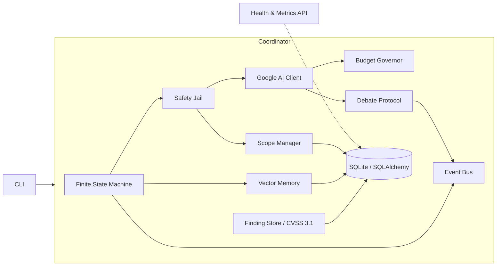

# ULTRON v6 — Autonomous Pentest Framework

[](https://github.com/nyadaryt5/Hacks/actions/workflows/ci.yml)
[](https://www.python.org/downloads/)
[](ultron-v6/LICENSE)
[](https://github.com/nyadaryt5/Hacks/actions)

**ULTRON v6** is a production-grade autonomous penetration testing framework
powered by Google AI (Gemini). It orchestrates LLM-driven security analysis
through a finite state machine (FSM), with budget guardrails, vector memory,
multi-agent debate for risky decisions, safety-jail command filtering and
span-based observability — plus health/metrics endpoints for deployments.

> ⚠️ **Authorized use only.** ULTRON is built for security professionals
> testing infrastructure they own or have explicit written permission to
> test. See [Security & Ethics](#security--ethics).

## Overview

ULTRON drives an autonomous recon → analysis → **iterative
plan/authorize/execute/verify loop** → reporting:

| # | Phase | State | What happens |
|---|-------|-------|--------------|
| 1 | **DISCOVERY** | `DISCOVERY` | nmap scans (jail-checked), service enumeration |
| 2 | **ANALYSIS** | `ANALYSIS` | Gemini analysis with vector-memory recall |
| 3 | **PLANNING** | `PLANNING` | LLM proposes the next action, with executed-action history |
| 4 | **AUTHORIZATION** | `AUTHORIZATION` | Multi-agent debate vetoes destructive plans |
| 5 | **EXECUTION** | `EXECUTION` | Jail-filtered command execution |
| 6 | **VERIFICATION** | `VERIFICATION` | LLM verifies results; findings are scored (CVSS 3.1) and lateral targets enter the approval flow |
| 7 | **REPORTING** | `REPORTING` | Markdown report: findings table, scope, budget, FSM history |

Phases 3–6 form a **bounded agent loop** (`ULTRON_MAX_ITERATIONS`, default
30): each cycle plans from fresh context (previous actions + finding
count), and the loop stops on goal success, plan veto, jail block, token
budget exhaustion, a repeated action, or no new progress.

### Features

- **Finite State Machine** — typed, validated transitions with full history
- **Iterative Agent Loop** — bounded plan/authorize/execute/verify cycles with
  progress-based stopping and repeated-action detection
- **Event Bus** — in-process pub/sub with fault-isolated subscribers
- **Vector Memory** — ChromaDB backend with a dependency-free hash fallback
- **Multi-Agent Debate** — attacker/defender/judge protocol for risky actions
- **Budget Governor** — session token budgets + per-key RPM/RPD rate limits
- **CVSS 3.1 Scoring** — official base-score equations implemented in-tree;
  findings are scored, severity-normalized, deduped and persisted
- **Scope Manager** — lateral-movement targets need depth-limited operator
  approval before they become jail-legal
- **Safety Jail** — shell-metacharacter blocklist, denylist of destructive
  patterns, and scope validation of IPs, URL hosts and FQDNs
- **Observability** — span-based tracing, structured JSON logging
- **Health & Metrics** — `/healthz`, `/readyz`, Prometheus `/metrics`
- **Typed config** — pydantic settings validated at startup (stdlib fallback)
- **Persistence** — SQLAlchemy ORM with a raw-SQLite fallback

## Architecture



```text
CLI (ultron.cli)
  └─ ULTRONCoordinator (ultron.coordinator)
       ├─ FiniteStateMachine (ultron.fsm)      states + transition table
       ├─ EventBus (ultron.events)             typed pub/sub
       ├─ VectorMemory (ultron.memory)         lessons + semantic recall
       ├─ BudgetGovernor (ultron.budget)       token/RPM/RPD limits
       ├─ GoogleAIClient (ultron.llm)          httpx + key rotation + retries
       ├─ DebateProtocol (ultron.debate)       attacker vs defender
       ├─ SafetyJail (ultron.safety)           metachars + denylist + host scope
       ├─ ScopeManager (ultron.scope)          lateral-movement approvals
       ├─ FindingStore (ultron.vulns)          CVSS 3.1 + deduped findings
       └─ DatabaseManager (ultron.db)          ORM models / SQLite fallback
```

A deeper dive with sequence diagrams lives in
[docs/architecture.md](docs/architecture.md).

## Quick start (Docker)

The compose stack is self-contained: `ultron-v6/Dockerfile` is the image
referenced by `docker-compose.yml` (repo-root build context). Neither
service requires a live Gemini account for liveness.

| Service | `GOOGLE_API_KEY` | Offline? |
|---------|------------------|----------|
| `ultron` (`serve`) | Optional. `/healthz` and `/metrics` do **not** call Gemini. | Yes — start with the key unset. |
| `ultron run <target>` | Required. Planning/execution calls Gemini. | No. |
| `test` (`docker compose run --rm test`) | Dummy key is injected; LLM is mocked. | Yes. |

```bash
# Offline: no API key needed for health/metrics
docker compose up --build
# health check:  curl http://localhost:8080/healthz
# metrics:       curl http://localhost:8080/metrics
```

Run a scan inside the container (needs a real key):

```bash
GOOGLE_API_KEY='AIza...' docker compose run --rm ultron run example.com
```

## Installation

Requirements: Python 3.10+.

```bash
# 1. Clone the repository
git clone https://github.com/nyadaryt5/Hacks.git
cd Hacks

# 2. Create a virtualenv and install the hash-pinned build/runtime/dev sets
python3 -m venv .venv
source .venv/bin/activate
python -m pip install -r ultron-v6/requirements-build.lock
python -m pip install -r ultron-v6/requirements.lock
python -m pip install -r ultron-v6/requirements-dev.lock
python -m pip install --no-build-isolation --no-deps -e .

# 3. Configure your Google AI API key (see Configuration below)
cp ultron-v6/.env.example .env
export GOOGLE_API_KEY='AIza...'

# 4. Verify the install
ultron-v6 --version
python -m ultron_v6 --help
```

Optional production integrations:

```bash
# ChromaDB plus the core runtime on Python 3.10/3.11. Chroma is constrained
# to the last release outside the unpatched 2026 advisory ranges; Python 3.12
# uses ULTRON's built-in hash-memory backend instead. ULTRON provides local
# embeddings and disables Chroma telemetry; no model download is required.
python -m pip install -r ultron-v6/requirements-chroma.lock

# Cross-version production integrations: AWS/Vault/GCP secrets + observability.
python -m pip install -r ultron-v6/requirements-all.lock
```

The commands above intentionally install committed lockfiles first and then
install the local package with `--no-deps`. This prevents an editable install
from silently resolving newer versions. Root `pyproject.toml` is the single
packaging and dependency manifest; `make lockfiles` regenerates every exact,
artifact-hashed package lock and its regular root-level mirror, while
`make lockfile-check` fails on manifest drift or mismatched mirrors. Run lock
commands with Python 3.11 (the fixed marker-resolution baseline); the resulting
locks install on the supported versions documented above. See
`ultron-v6/README.md` for details.

## Configuration

ULTRON reads configuration from environment variables. Copy
[`ultron-v6/.env.example`](ultron-v6/.env.example) as a starting point
and export the values (or use a `.env` loader of your choice).

| Variable | Default | Description |
|----------|---------|-------------|
| `GOOGLE_API_KEY` | — | Primary Gemini API key (**required for scans**) |
| `GOOGLE_API_KEY_1` … `GOOGLE_API_KEY_10` | — | Additional keys, rotated per request |
| `ULTRON_MODEL` | `gemini-1.5-flash` | Gemini model |
| `ULTRON_BASE_URL` | Google Gemini endpoint | OpenAI-compatible API endpoint |
| `ULTRON_MAX_RPM_PER_KEY` / `ULTRON_MAX_RPD_PER_KEY` | `14` / `1400` | Per-key request limits |
| `ULTRON_TEMPERATURE` / `ULTRON_MAX_TOKENS` | `0.3` / `3000` | Model generation controls |
| `ULTRON_TIMEOUT_SECONDS` | `120` | LLM request timeout (5–300 seconds) |
| `ULTRON_MAX_ITERATIONS` | `30` | Max FSM cycles |
| `ULTRON_MAX_LATERAL_DEPTH` | `2` | Max lateral-movement depth |
| `ULTRON_OUTPUT_MAX_CHARS` | `4000` | Max tool output kept (500–10000) |
| `ULTRON_CACHE_TTL_HOURS` | `24` | Memory cache TTL |
| `ULTRON_LOG_LEVEL` | `INFO` | `DEBUG`/`INFO`/`WARNING`/`ERROR`/`CRITICAL` |
| `ULTRON_JSON_LOGS` | `false` | Structured JSON output; CLI flags override it |
| `ULTRON_PORT` | `8080` | Host port published by Docker Compose |
| `ULTRON_SENTRY_DSN` | — | Optional Sentry DSN; unset means no error export |
| `ULTRON_BUDGET_MAX_TOKENS_PER_SESSION` | `500000` | Session token budget |
| `ULTRON_BUDGET_MAX_TOKENS_PER_MINUTE` | `10000` | Per-minute token budget |
| `ULTRON_BUDGET_MAX_TOKENS_PER_HOUR` | `100000` | Per-hour token budget |
| `ULTRON_BUDGET_MAX_COST_PER_SESSION_USD` | `1.0` | Session cost cap |
| `ULTRON_BUDGET_WARN_AT_PERCENT` | `80.0` | Warning threshold (%) |
| `ULTRON_DB_URL` | `sqlite:///ultron_v6.db` | SQLAlchemy database URL |
| `ULTRON_DB_ECHO` / `ULTRON_DB_POOL_SIZE` | `false` / `5` | SQL logging and pool size |
| `ULTRON_SECRETS_BACKEND` | `env` | `env`, `aws`, `vault`, or `gcp` secret source |
| `ULTRON_AWS_SECRET_ID` / `ULTRON_AWS_REGION` | — | AWS secret id/ARN and optional region |
| `ULTRON_VAULT_ADDR` / `ULTRON_VAULT_TOKEN` / `ULTRON_VAULT_SECRET_PATH` | — | HashiCorp Vault KV v2 settings |
| `ULTRON_GCP_SECRET_NAME` | — | GCP Secret Manager resource name |

Configuration is validated at startup by pydantic; missing keys or invalid
values fail fast with a clear error (exit code 1). Secret managers are also
**fail-closed**: after `aws`, `vault`, or `gcp` is selected, a missing SDK,
invalid manager configuration, provider error, or empty payload aborts startup.
ULTRON never masks that failure by using an environment key. Manager values
replace stale `GOOGLE_API_KEY` process state, and coordinator credentials are
removed from the environment inherited by executed tools.

## Usage

```bash
# Run the pipeline against a target (authorized scope!)
ultron-v6 run 192.168.1.100
ultron-v6 example.com                       # 'run' shorthand

# Structured JSON logs
ultron-v6 run example.com --json-logs

# Serve the health/metrics API
ultron-v6 serve --host 0.0.0.0 --port 8080

# Legacy entry point still works
python3 ultron-v6/ultron_v6.py example.com
```

Endpoints served by `ultron-v6 serve`:

| Endpoint | Purpose |
|----------|---------|
| `/healthz` | Liveness probe → `{"status": "ok", ...}` |
| `/readyz` | Readiness probe (injectable check) |
| `/metrics` | Prometheus text-format metrics |

### Output artifacts

- `ultron_v6.db` — SQLite database (findings, lessons, state)
- `ULTRON_V6_REPORT_<session>.md` — markdown pentest report
- `*.log` — when a log file sink is configured

## Testing

The test suite runs from a fresh clone without any external services or API
accounts. Install dependencies using the pinned commands in the installation
section, then run:

```bash
pytest tests                                # full offline suite
pytest tests --cov=ultron --cov-report=term-missing --cov-fail-under=85
flake8 ultron-v6/ultron ultron-v6/ultron_v6.py tests
mypy ultron-v6/ultron ultron-v6/ultron_v6.py
ruff check ultron-v6/ultron
bandit -r ultron-v6/ultron -c pyproject.toml
pip-audit --strict -r ultron-v6/requirements.lock
pip-audit --strict -r ultron-v6/requirements-all.lock
make lockfile-check                         # resolve + byte-compare every lock
```

Tests use `httpx.MockTransport` for LLM requests and a local/hash-backed
memory/database path. Tests that genuinely require a service must use the
registered `network` marker; pytest excludes those by default. Opt into them
with `pytest -m network` when the required service is available.

CI runs the same gates on every push and pull request
([`.github/workflows/ci.yml`](.github/workflows/ci.yml)) across Python 3.10,
3.11 and 3.12. Separate jobs install cross-version integrations on 3.10/3.12
and the constrained Chroma set on 3.10/3.11. The workflow also builds the
wheel/source distribution plus downloadable CycloneDX SBOMs.

## Project layout

```text
.
├── .github/workflows/ci.yml        # lint + typecheck + tests + security
├── pyproject.toml                  # PEP 621 package + dependency source
├── .env.example                    # root-visible config template mirror
├── requirements*.lock              # root-visible regular lockfile mirrors
├── scripts/lockfiles.py             # deterministic generation/drift check
├── docs/architecture.md            # design documentation
├── tests/                          # pytest suite (repo root)
└── ultron-v6/
    ├── ultron/                     # the framework package
    │   ├── config.py               # typed settings (+ stdlib fallback)
    │   ├── logging_setup.py        # text / structured JSON logging
    │   ├── tracing.py              # span-based observability
    │   ├── budget.py               # token & rate-limit governor
    │   ├── fsm.py                  # state machine + transition table
    │   ├── events.py               # event bus
    │   ├── db.py                   # ORM models / SQLite fallback
    │   ├── memory.py               # vector memory
    │   ├── json_utils.py           # tolerant JSON parsing
    │   ├── safety.py               # metachar/denylist/host-scope jail
    │   ├── scope.py                # lateral-movement approval flow
    │   ├── llm.py                  # Gemini client (httpx, retries)
    │   ├── debate.py               # multi-agent debate
    │   ├── vulns.py                # CVSS 3.1 engine + finding store
    │   ├── coordinator.py          # FSM-driven iterative agent loop
    │   ├── api.py                  # health/metrics server
    │   └── cli.py                  # command line interface
    ├── ultron_v6.py                # backwards-compatible entry module
    ├── requirements*.lock          # pyproject-derived pinned dependency sets
    ├── .env.example                # package-local config template mirror
    └── LICENSE
```

## Security & Ethics

ULTRON includes multiple safety layers:

1. **System-prompt jail** — the LLM is forced into an authorized-testing context
2. **Safety jail** — shell-metacharacter blocklist (`; | & \` $ < >`),
   denylist of destructive patterns (e.g. `rm -rf /`, reverse shells)
3. **Scope validation** — every IP literal, URL host and FQDN in a command
   must be authorized; the discovery scan itself is jail-checked
4. **Scope manager** — newly discovered adjacent assets enter a
   depth-limited approval queue (`LATERAL_TARGET_FOUND` events) and are only
   jail-legal after explicit approval
5. **Multi-agent debate** — destructive actions require adversarial approval
6. **Budget guardrails** — prevents runaway API cost
7. **Secure defaults** — metrics server binds localhost by default,
   tools run without a shell, dependencies are audited in CI

**Always ensure you have written authorization before testing any
infrastructure.** Unauthorized scanning is illegal in most jurisdictions.

### Secret management

Environment keys are supported for local use. In any **deployed or shared
context**, set `ULTRON_SECRETS_BACKEND` so the key is resolved directly from
AWS Secrets Manager, GCP Secret Manager, or HashiCorp Vault rather than a
plain, long-lived `.env` file. Manager mode fails closed and never silently
falls back to env credentials. Real `.env` files are excluded from Git and the
Docker build context; never commit a key.

A full threat model (prompt-injection, jail-bypass, key-exposure and
out-of-scope-targeting risks, each with a mitigation reference) is documented
in [SECURITY.md](SECURITY.md).

## License

MIT — see [ultron-v6/LICENSE](ultron-v6/LICENSE).
