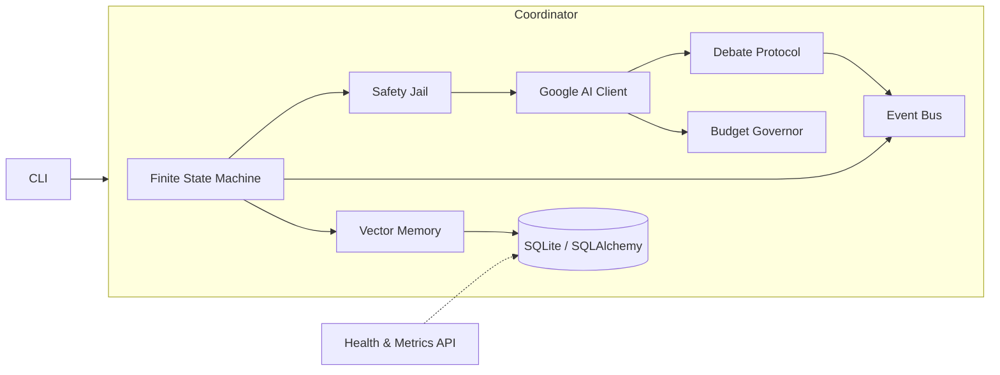

# ULTRON v6 — Autonomous Pentest Framework

[](https://github.com/nyadaryt5/Hacks/actions/workflows/ci.yml)
[](https://www.python.org/downloads/)
[](ultron-v6/LICENSE)
[](https://github.com/nyadaryt5/Hacks/actions)

**ULTRON v6** is a production-grade autonomous penetration testing framework
powered by Google AI (Gemini). It orchestrates LLM-driven security analysis
through a finite state machine (FSM), with budget guardrails, vector memory,
multi-agent debate for risky decisions, safety-jail command filtering and
span-based observability — plus health/metrics endpoints for deployments.

> ⚠️ **Authorized use only.** ULTRON is built for security professionals
> testing infrastructure they own or have explicit written permission to
> test. See [Security & Ethics](#security--ethics).

## Overview

ULTRON drives an autonomous recon → analysis → planning → authorization →
execution → verification → reporting loop:

| # | Phase | State | What happens |
|---|-------|-------|--------------|
| 1 | **DISCOVERY** | `DISCOVERY` | nmap scans, service enumeration |
| 2 | **ANALYSIS** | `ANALYSIS` | Gemini analysis with vector-memory recall |
| 3 | **PLANNING** | `PLANNING` | LLM proposes the next action (tool/code) |
| 4 | **AUTHORIZATION** | `AUTHORIZATION` | Multi-agent debate vetoes destructive plans |
| 5 | **EXECUTION** | `EXECUTION` | Jail-filtered command execution |
| 6 | **VERIFICATION** | `VERIFICATION` | LLM verifies results, publishes findings |
| 7 | **REPORTING** | `REPORTING` | Writes a markdown pentest report |

### Features

- **Finite State Machine** — typed, validated transitions with full history
- **Event Bus** — in-process pub/sub with fault-isolated subscribers
- **Vector Memory** — ChromaDB backend with a dependency-free hash fallback
- **Multi-Agent Debate** — attacker/defender/judge protocol for risky actions
- **Budget Governor** — session token budgets + per-key RPM/RPD rate limits
- **Safety Jail** — denylist of destructive patterns + scope validation
- **Observability** — span-based tracing, structured JSON logging
- **Health & Metrics** — `/healthz`, `/readyz`, Prometheus `/metrics`
- **Typed config** — pydantic settings validated at startup (stdlib fallback)
- **Persistence** — SQLAlchemy ORM with a raw-SQLite fallback

## Architecture



```text
CLI (ultron.cli)
  └─ ULTRONCoordinator (ultron.coordinator)
       ├─ FiniteStateMachine (ultron.fsm)      states + transition table
       ├─ EventBus (ultron.events)             typed pub/sub
       ├─ VectorMemory (ultron.memory)         lessons + semantic recall
       ├─ BudgetGovernor (ultron.budget)       token/RPM/RPD limits
       ├─ GoogleAIClient (ultron.llm)          httpx + key rotation + retries
       ├─ DebateProtocol (ultron.debate)       attacker vs defender
       ├─ SafetyJail (ultron.safety)           scope + command filtering
       └─ DatabaseManager (ultron.db)          ORM models / SQLite fallback
```

A deeper dive with sequence diagrams lives in
[docs/architecture.md](docs/architecture.md).

## Quick start (Docker)

```bash
docker compose up --build
# health check:  curl http://localhost:8080/healthz
# metrics:       curl http://localhost:8080/metrics
```

Run a scan inside the container:

```bash
docker compose run --rm ultron run example.com
```

## Installation

Requirements: Python 3.10+.

```bash
# 1. Clone the repository
git clone https://github.com/nyadaryt5/Hacks.git
cd Hacks

# 2. Create a virtualenv and install the package (editable, with dev tools)
python3 -m venv .venv
source .venv/bin/activate
pip install -e "./ultron-v6[dev]"          # reproducible: pip install -r ultron-v6/requirements.lock

# 3. Configure your Google AI API key (see Configuration below)
cp ultron-v6/.env.example .env
export GOOGLE_API_KEY='AIza...'

# 4. Verify the install
ultron-v6 --version
python -m ultron_v6 --help
```

Optional extras:

```bash
pip install -e "./ultron-v6[chroma]"   # ChromaDB vector backend
pip install -e "./ultron-v6[all]"      # everything
```

## Configuration

ULTRON reads configuration from environment variables. Copy
[`ultron-v6/.env.example`](ultron-v6/.env.example) as a starting point
and export the values (or use a `.env` loader of your choice).

| Variable | Default | Description |
|----------|---------|-------------|
| `GOOGLE_API_KEY` | — | Primary Gemini API key (**required**) |
| `GOOGLE_API_KEY_1..10` | — | Additional keys, rotated per request |
| `ULTRON_MODEL` | `gemini-1.5-flash` | Gemini model |
| `ULTRON_MAX_ITERATIONS` | `30` | Max FSM cycles |
| `ULTRON_MAX_LATERAL_DEPTH` | `2` | Max lateral-movement depth |
| `ULTRON_OUTPUT_MAX_CHARS` | `4000` | Max tool output kept (500–10000) |
| `ULTRON_CACHE_TTL_HOURS` | `24` | Memory cache TTL |
| `ULTRON_LOG_LEVEL` | `INFO` | `DEBUG`/`INFO`/`WARNING`/`ERROR`/`CRITICAL` |
| `ULTRON_BUDGET_MAX_TOKENS_PER_SESSION` | `500000` | Session token budget |
| `ULTRON_BUDGET_MAX_TOKENS_PER_MINUTE` | `10000` | Per-minute token budget |
| `ULTRON_BUDGET_MAX_TOKENS_PER_HOUR` | `100000` | Per-hour token budget |
| `ULTRON_BUDGET_MAX_COST_PER_SESSION_USD` | `1.0` | Session cost cap |
| `ULTRON_BUDGET_WARN_AT_PERCENT` | `80.0` | Warning threshold (%) |
| `ULTRON_DB_URL` | `sqlite:///ultron_v6.db` | SQLAlchemy database URL |

Configuration is validated at startup by pydantic; missing keys or invalid
values fail fast with a clear error (exit code 1).

## Usage

```bash
# Run the pipeline against a target (authorized scope!)
ultron-v6 run 192.168.1.100
ultron-v6 example.com                       # 'run' shorthand

# Structured JSON logs
ultron-v6 run example.com --json-logs

# Serve the health/metrics API
ultron-v6 serve --host 0.0.0.0 --port 8080

# Legacy entry point still works
python3 ultron-v6/ultron_v6.py example.com
```

Endpoints served by `ultron-v6 serve`:

| Endpoint | Purpose |
|----------|---------|
| `/healthz` | Liveness probe → `{"status": "ok", ...}` |
| `/readyz` | Readiness probe (injectable check) |
| `/metrics` | Prometheus text-format metrics |

### Output artifacts

- `ultron_v6.db` — SQLite database (findings, lessons, state)
- `ULTRON_V6_REPORT_<session>.md` — markdown pentest report
- `*.log` — when a log file sink is configured

## Testing

The test suite runs from a fresh clone without any external services:

```bash
pip install -e "./ultron-v6[dev]"
pytest                                     # full suite (144 tests)
pytest --cov=ultron --cov-fail-under=85    # coverage gate
flake8 ultron-v6/ultron ultron-v6/ultron_v6.py tests
mypy ultron-v6/ultron ultron-v6/ultron_v6.py
ruff check ultron-v6/ultron
bandit -r ultron-v6/ultron -c pyproject.toml
pip-audit --requirement ultron-v6/requirements.lock
```

CI runs all of the above on every push and pull request
([`.github/workflows/ci.yml`](.github/workflows/ci.yml)) across
Python 3.10, 3.11 and 3.12.

## Project layout

```text
.
├── .github/workflows/ci.yml        # lint + typecheck + tests + security
├── docs/architecture.md            # design documentation
├── tests/                          # pytest suite (repo root)
└── ultron-v6/
    ├── ultron/                     # the framework package
    │   ├── config.py               # typed settings (+ stdlib fallback)
    │   ├── logging_setup.py        # text / structured JSON logging
    │   ├── tracing.py              # span-based observability
    │   ├── budget.py               # token & rate-limit governor
    │   ├── fsm.py                  # state machine + transition table
    │   ├── events.py               # event bus
    │   ├── db.py                   # ORM models / SQLite fallback
    │   ├── memory.py               # vector memory
    │   ├── json_utils.py           # tolerant JSON parsing
    │   ├── safety.py               # scope + command jail
    │   ├── llm.py                  # Gemini client (httpx, retries)
    │   ├── debate.py               # multi-agent debate
    │   ├── coordinator.py          # FSM-driven pipeline
    │   ├── api.py                  # health/metrics server
    │   └── cli.py                  # command line interface
    ├── ultron_v6.py                # backwards-compatible entry module
    ├── pyproject.toml              # PEP 621 packaging + dependencies
    ├── requirements*.txt/.lock     # manifests + pinned lockfiles
    ├── .env.example                # environment variable reference
    └── LICENSE
```

## Security & Ethics

ULTRON includes multiple safety layers:

1. **System-prompt jail** — the LLM is forced into an authorized-testing context
2. **Safety jail** — blocks destructive patterns (e.g. `rm -rf /`,
   reverse shells) and out-of-scope IPs
3. **Scope validation** — every IP literal in a command must be authorized
4. **Multi-agent debate** — destructive actions require adversarial approval
5. **Budget guardrails** — prevents runaway API cost
6. **Secure defaults** — metrics server binds localhost by default,
   tools run without a shell, dependencies are audited in CI

**Always ensure you have written authorization before testing any
infrastructure.** Unauthorized scanning is illegal in most jurisdictions.

## License

MIT — see [ultron-v6/LICENSE](ultron-v6/LICENSE).
