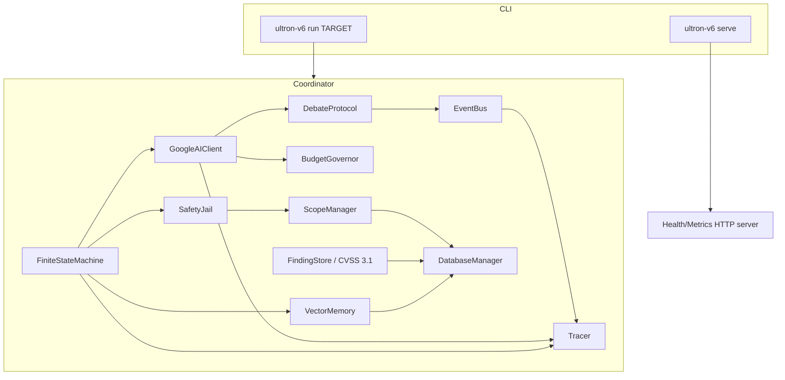
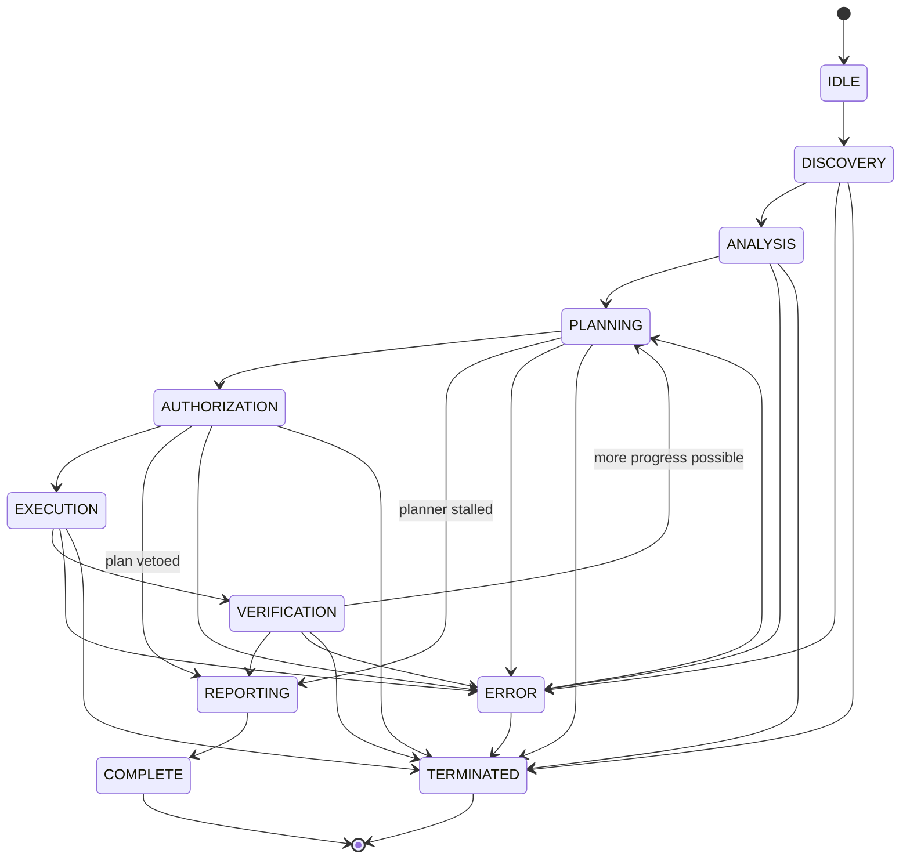
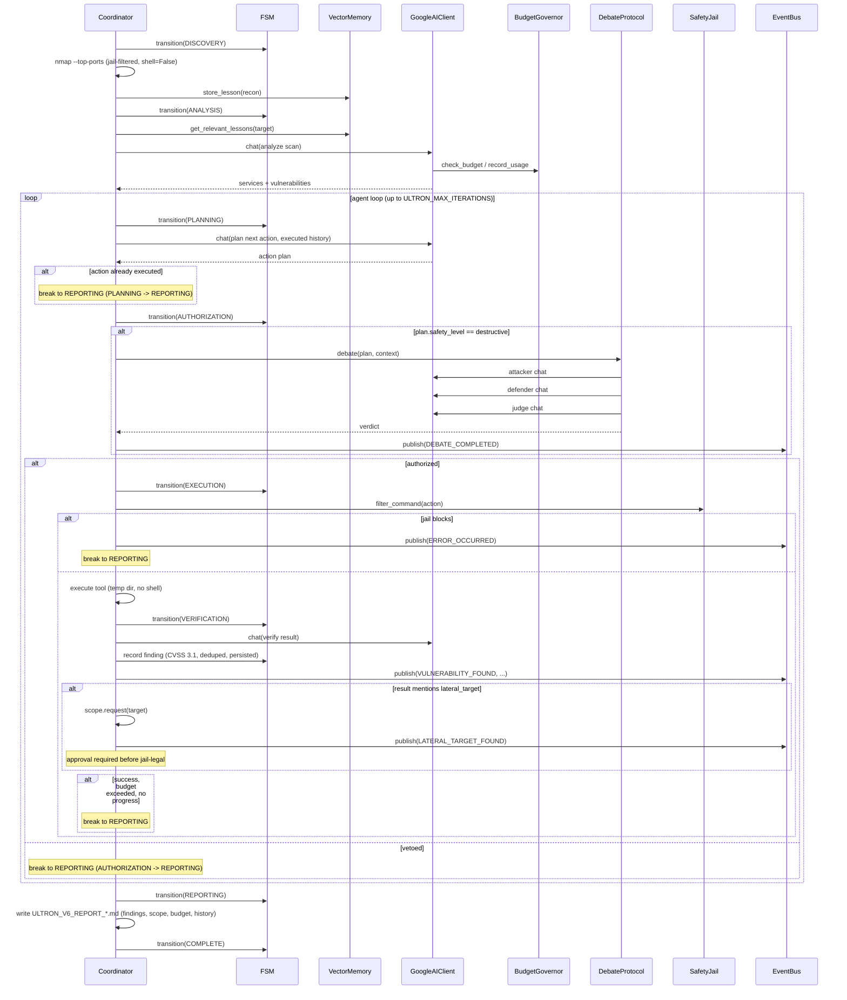

# ULTRON v6 — Architecture

## 1. Component map

## 2. FSM lifecycle

States and legal transitions (source of truth: `ultron/fsm.py`):

Every transition is validated against `VALID_TRANSITIONS`, recorded in
`FiniteStateMachine.history` (old state, new state, timestamp), and emitted
as a `SpanType.STATE_TRANSITION` trace span.

## 3. Phase sequence

## 4. Budget guardrails

`BudgetGovernor` (ultron/budget.py) enforces, per API key:

- **Session token budget** — `ULTRON_BUDGET_MAX_TOKENS_PER_SESSION`
- **Per-key RPM** — `max_rpm_per_key` (14 by default)
- **Per-key RPD** — `max_rpd_per_key` (1400 by default)
- **Warning threshold** — one `BUDGET_WARNING` event when usage crosses
  `warn_at_percent` (published once per session)

`GoogleAIClient.chat()` checks the budget *before* the HTTP call, records
usage *after* a successful response, and rotates to the next API key on
HTTP 429.

## 5. Safety layers

1. **Prompt jail** — the LLM system prompt pins an authorized-testing context.
2. **Shell-metacharacter blocklist** — `; | & \` $ < >` and newlines are
   refused outright: the executor uses `shell=False`, so these characters
   can never do useful work and are the main prompt-injection chaining
   vector.
3. **SafetyJail.filter_command** — blocks denylisted destructive patterns
   (`rm -rf /`, reverse shells, writes to `/etc`, ...) and any IP literal,
   URL host or bare FQDN outside the authorized scope.
4. **Execution hygiene** — `shlex.split` + `shell=False` + system temp dir;
   the discovery scan is jail-checked too.
5. **Scope manager** — adjacent assets discovered during verification enter
   a depth-limited approval queue (`LATERAL_TARGET_FOUND` events, persisted
   to `lateral_targets`) and only become jail-legal via `approve()`.
6. **Debate veto** — destructive plans require attacker/defender/judge
   approval before execution.

## 6. Persistence

`DatabaseManager` selects between:

- `SQLAlchemyDatabaseManager` — declarative models: `episodes`,
  `target_state`, `goals`, `findings`, `lateral_targets`, `lesson_memory`.
- `SQLiteDatabaseManager` — stdlib-only fallback with the same schema.

`VectorMemory` stores lessons in both the vector store (ChromaDB, or an
in-memory 128-dim hash embedding with cosine similarity) and the
relational database.

`FindingStore` (ultron/vulns.py) writes every deduplicated finding to the
`findings` table (with CVSS vector/score) and `ScopeManager` (ultron/scope.py)
tracks `lateral_targets` rows through pending → approved, on whichever
backend is active. Persistence is best-effort: a failing database degrades
to in-memory state instead of aborting the session.

## 7. Threat model

ULTRON is an LLM that proposes shell commands. The untrusted zone is
everything the model returns and everything a target sends back. The
trusted zone is the operator's authorized scope, denylists and budgets.

| Abuse case | Mitigation |
|------------|------------|
| **Prompt injection** via banners / scan output steering the model | SafetyJail denylist + scope check on every command; system-prompt jail (`GEMINI_CONTEXT_PREFIX`) |
| **Scope escape** (scan/exploit an unauthorized host) | `SafetyJail.validate_scope` + `ScopeManager` approval queue; `ULTRON_MAX_LATERAL_DEPTH` |
| **Destructive command execution** (`rm -rf /`, reverse shells) | `FORBIDDEN_PATTERNS`, `shell=False`, debate protocol veto for `safety_level=destructive` |
| **API key leakage / wallet drain** | Keys from AWS Secrets Manager / Vault / GCP (`ultron/secrets.py`); never logged; `BudgetGovernor` + `ULTRON_MAX_ITERATIONS` |

Trust boundaries and reporting process: [SECURITY.md](../SECURITY.md).

## 8. Observability

- `Tracer` — span-based tracing: `LLM_CALL`, `TOOL_EXECUTION`,
  `STATE_TRANSITION`, `EVENT_PUBLISHED`, `EVENT_CONSUMED`, `VECTOR_QUERY`,
  `DEBATE`; per-span token and cost attribution.
- `logging_setup.configure_logging` — human-readable or JSON record
  formats, optional file sink.
- `api.start_server` — `/healthz`, `/readyz`, Prometheus `/metrics`.
